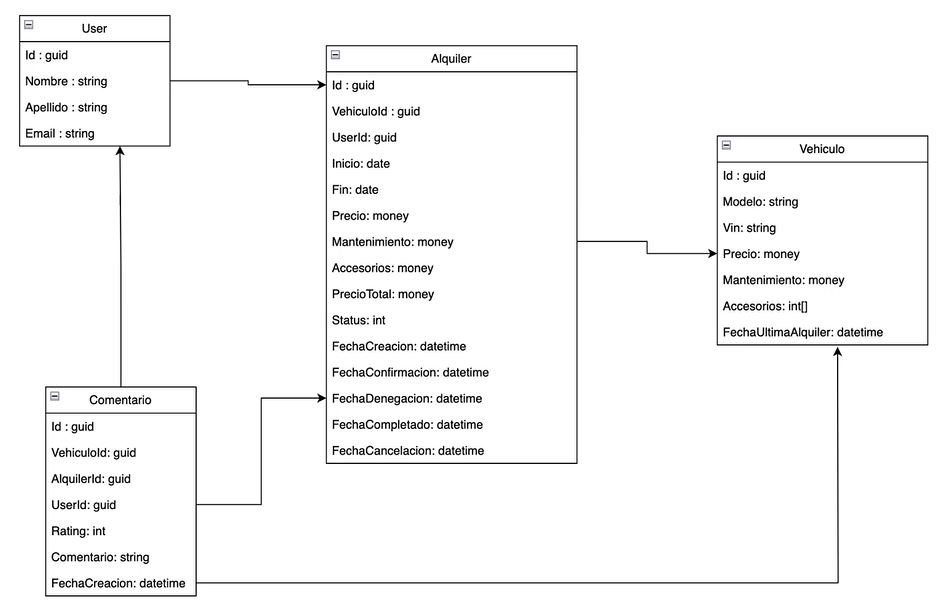
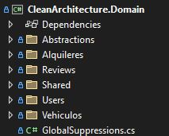
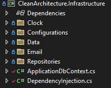

# Clean architecture y Domain Driven Design

Ejercicios tomados del curso de .Net University en Udemy: **Clean Architecture y Domain Driven Design en ASP.NET Core 8**, y complementado con apuntes propios.

---

# Índice completo de contenidos 📋
1. **[Clean architecture en .NET](#Seccion_01_Clean)**
2. **[Capa de Domain](#Seccion_02_Capa_Domain)**
3. **[Capa de Application](#Seccion_03_Capa_Application)**
4. **[Capa de Infrastructure](#Seccion_04_Capa_Infrastructure)**

---

# Toma de contacto  🚀 <a name="Toma_Contacto"></a>

## Principales puntos 📋
* Por completar.
* Uso de Central Package Management (CPM) para paquetes Nuget
https://learn.microsoft.com/en-us/nuget/consume-packages/central-package-management

## Pre-requisitos 📋
Como herramientas de desarrollo necesitarás:
* Visual Studio 2022 (con la versión para .NET 8)
* SQL Server (con la versión Express es suficiente)
* Tener instalado el [Command-line interface (CLI) de EF](https://learn.microsoft.com/en-us/ef/core/cli/dotnet). Ejecutar en un cmd:
```
dotnet tool install --global dotnet-ef
```

## Antes de comenzar... entiende la base de datos que vamos a utilizar ⚙️
Los ejemplos se realizan sobre una base de datos de alquileres de coches.


## Agradecimientos 🎁

* Plataforma de aprendizaje online [Udemy](https://www.udemy.com/share/109PRS3@gz4ZDXhSu8i9pa_CnjiahHDgwCptf9vw-CYR0FqedgI2UGsgwy4nmPTe3ehw5QaGMA==/)
* A cualquiera que me invite a una cerveza 🍺.

---

# SECCIÓN 01. Clean architecture en .NET <a name="Seccion_01_Clean"></a>


---

# SECCIÓN 02. Proyecto CleanArchitecture.Domain <a name="Seccion_02_Capa_Domain"></a>

**Estructura de carpetas:**


**CleanArchitecture.Domain.Abstractions:**
* `public abstract class Entity`: para identificar entidades, y poner un `Guid` a las clases de tipo entidad. La propiedad tiene como setter `init`,  Init indica que una vez que ha sido inicializada la propiedad, no se puede cambiar su valor.
* `public interface IDomainEvents : INotification`: para configurar eventos de dominio. La entidad base `Entity`, manejará estos eventos.

**Principales características de una entidad de dominio:**
* Clase `sealed`: para que esté sellada.
* Debe tener un identificador, debe heredar de la clase abstracta `Entity`.
* Propiedades con setter `private set`: para cambiar los valores se deberá hacer a través de métodos.
* Constructor privado. Existirá un factory method llamado `Create` para la cración de la clase.

**Creación de Value objects:**
* Ejemplos con records simples: Direccion, Modelo, Vin. Aportan legibilidad al negocio. Representados como records, por lo que no cambian de valor.
* Ejemplos con records complejos: `TipoMoneda`, `Moneda`.

**Creación de eventos de dominio y notificaciones:**
* Para cambios en el estado de una entidad.
* Creados a través del paquete Nuget `MediatR.Contracts`.
* Ejemplos:  `Alquileres/AlquilerCanceladoDomainEvent`, `Users/UserCreatedDomainEvent`.

**Creación de **servicios de dominio**:**
* Un ejemplo es la clase `PrecioService`, para realizar cálculos de precios.

**Creación de los contratos de acceso a base de datos (repositorios) y persistencia (unit of work):**
* Repositorios: ejemplo `IUserRepository`.
* Unit of work: ejemplo `IUnitOfWork`.

**Creación de objetos de Results:**
* Clase `Abstractions/Result`: clase para poder devolver resultados estructurados.
* Clase `Abstractions/Error`: clase para poder devolver errores estructurados. Posteriormente se crearán errores propios de cada dominio (por ejemplo, de tipo `AlquilerErrors`).

**Objetos shared en Domain Model:**
* Dentro del modelo hay componentes que se va a reusar dentro de las entidades.
* Por ejemplo: `Shared/TipoMoneda`, `Shared/Moneda`.

---

# SECCIÓN 03. Proyecto CleanArchitecture.Application <a name="Seccion_03_Capa_Application"></a>

**Estructura de carpetas:**


**Paquetes Nuget:**
* Uso de `MediatR`: MediatR es una implementación del patrón mediador que ocurre completamente en el mismo proceso de la aplicación (in-process), y es una herramienta fundamental para crear sistemas basados en CQRS. Toda la comunicación entre el usuario y la capa de persistencia se gestiona a través de MediatR.
* Uso de `Dapper`.

**Carpeta `Abstractions`, que dentro contiene, entre otros:**
* Carpeta `Behaviours` (Interceptores para *cross cutting concerns): en esta carpeta se encuentran los interceptores:
	* `LoggingBehavior`: interceptor que captura todos los request que envíe el cliente, al insertar un nuevo record de tipo Command que implementen IBaseCommand. Comportamiento para registrar información de log al ejecutar commands (IBaseCommand).
	* `ValidationBehavior`: interceptor que captura las solicitudes de comando antes de ser manejadas por los controladores correspondientes para validar sus datos meciante Fluent Validation.
* Carpeta `Messaging`: en esta carpeta se encuentran las interfaces relacionadas con el manejo de mensajes dentro de la aplicación.
	* Interfaces para **Queries**: 
		* `IQuery`: Define una interfaz para las consultas que devuelven un resultado.
			* Por ejemplo, para devolver todos los usuarios, se crearía la clase `ConsultasUsuarioQuery`.
		* `IQueryHandler`: Define una interfaz para los controladores de consultas.
			* Por ejemplo, para manejar consultas relacionadas con usuarios, se crearía una clase que implemente esta interfaz, como `ConsultasUsuarioQueryHandler`.
	* Interfaces para **Commands**: 
		* `ICommand`: Define una interfaz para los comandos que no devuelven ningún resultado.
			* Por ejemplo, para crear un usuario, se crearía la clase `UsuarioCommand`.
		* `ICommandHandler`: Define una interfaz para los controladores de comandos.
			* Por ejemplo, para manejar comandos relacionados con usuarios, se crearía una clase que implemente esta interfaz, como `UsuarioCommandHandler`.

**Carpeta `Exceptions`, que dentro contiene, entre otros:**
* Clase `ValidationException`, que contiene una lista de errores de tipo `ValidationError`.

**Carpeta `Alquileres`, que dentro contiene la lógica de alquileres, entre otros**:
* Lógica para gestionar alquileres, con sus correspondientes Query, Command, etc.
* Esta lógica tiene encuentra errores de concurrencia `ConcurrencyException`.

**Carpeta `Vehiculos`, que dentro contiene la lógica de vehículos, entre otros**:
* Lógica para buscar vehículos, con sus correspondientes Query.

**Clase `DependencyInjection.cs`, encargada de la inyección de dependencias, por ejemplo, de**:
* Registrar los servicios, como por ejemplo `PrecioService`.
* Registrar los datos necesarios de `MediatR`, como los Command, Queries y sus respectivos Handlers a través del patrón Mediator.

---

# SECCIÓN 04. Proyecto CleanArchitecture.Infrastructure <a name="Seccion_04_Capa_Infrastructure"></a>

**Estructura de carpetas:**


**Paquetes Nuget:**
* Uso de `EFCore.NamingConventions`, `Microsoft.EntityFrameworkCore`, `Microsoft.EntityFrameworkCore.Tools`, `Npgsql.EntityFrameworkCore.PostgreSQL`.

**Carpeta `Configurations`, que dentro contiene, los mapeos de las entidades a las tablas de base de datos.**

**Carpeta `Data`, con las configuraciones necesarias para Dapper:**
* `SqlConnectionFactory`, factoría de conexión que se utilizará para Dapper (consultas). Implementa la interfaz `ISqlConnectionFactory`.
* `DateOnlyTypeHandler`, clase para manejar la conversión entre el tipo de datos .NET DateOnly y el tipo de datos de la base de datos.

**Carpeta `Clock`, que dentro contiene la implementación de la interfaz `IDateTimeProvider`. Esta implementación va a ser:
* `internal`, ya que vamos a utilizar la interfaz, que sí será pública.
* `sealed`, ya que va a estar sellada y no permititrá su herencia.

**Carpeta `Email`, que dentro contiene la implementación de la interfaz `EmailService`. Esta implementación va a ser:
* `internal`, ya que vamos a utilizar la interfaz, que sí será pública.
* `sealed`, ya que va a estar sellada y no permititrá su herencia.
* Se trata de una simulación de envío no implementado.

**Carpeta `Repositories`, que dentro contiene la implementación de las interfaces de dominio `IAlquilerRepository`, `IUserRepository`, etc.

**Clase `ApplicationDbContext.cs`, Clase que representa el contexto de la base de datos de la aplicación, se encarga de**:
* Configurar el modelo de la base de datos.
* Guardar los cambios en la base de datos y publicar los eventos de dominio asociados mediante el publisher de `MediatR`.
* Controlar los *errores por concurrencia optimista*. Para más info, revisar `ReservarAlquilerCommandHandler.cs` y `VehiculoConfiguration.cs` (añade una columna de versión en cada fila para registros optimistas).

**Clase `DependencyInjection.cs`, encargada de la inyección de dependencias, por ejemplo, de**:
* Registrar los servicios, como por ejemplo `DateTimeProvider` y `EmailService`.
* Registro de la base de datos.